# Data Entity Diagram — Reference/Configuration Tables

This diagram shows the 14 pricing reference data tables that are seeded from the pricing workbook, plus key related operational tables.

```mermaid
erDiagram
    %% ===== HOUSE CATALOG =====
    HouseDesign {
        int design_id PK
        string brand
        string house_name UK "unique(brand, house_name)"
        decimal base_price
        string storey
        decimal frontage
        decimal depth
        decimal gf_sqm
        decimal total_sqm
        decimal lot_total_sqm
        int squares
        text details
        date effective_date
        bool active
    }

    HouseFacade {
        int facade_id PK
        int design_id FK
        string facade_name UK "unique(design_id, facade_name)"
        decimal facade_price
        text facade_details
        bool is_included
    }

    EnergyRating {
        int rating_id PK
        int design_id FK
        string garage_side UK "unique(design_id, garage_side, orientation)"
        string orientation
        decimal star_rating
        string best_worst
        decimal compliance_cost
    }

    HouseDesign ||--o{ HouseFacade : "has facades"
    HouseDesign ||--o{ EnergyRating : "has energy ratings"

    %% ===== UPGRADES =====
    UpgradeCategory {
        int category_id PK
        string brand
        string name
        int sort_order
    }

    UpgradeItem {
        int upgrade_id PK
        string brand
        int category_id FK
        text description
        decimal price
        date date_added
        text notes
        int sort_order
    }

    UpgradeCategory ||--o{ UpgradeItem : "contains"

    %% ===== COMMISSIONS =====
    WholesaleGroup {
        int group_id PK
        string group_name UK
        bool gst_registered
        bool active
    }

    CommissionRate {
        int rate_id PK
        int bdm_profile_id FK "unique(bdm_profile_id, group_id)"
        int group_id FK
        decimal commission_fixed
        decimal commission_pct
        string brand
    }

    Profile {
        int profile_id PK
        string email UK
        string first_name
        string last_name
    }

    WholesaleGroup ||--o{ CommissionRate : "rates per group"
    Profile ||--o{ CommissionRate : "BDM earns"

    %% ===== TRAVEL & LOCATION =====
    TravelSurcharge {
        int surcharge_id PK
        string suburb_name UK
        string postcode
        decimal surcharge_amount
        string region_name
    }

    PostcodeSiteCost {
        string postcode PK
        decimal rock_removal_cost
    }

    %% ===== SITE COSTS =====
    SiteCostTier {
        int tier_id PK
        string tier_name
        int fall_min_mm
        int fall_max_mm
    }

    SiteCostItem {
        int item_id PK
        int tier_id FK
        string item_name
        string condition_type
        text condition_description
        decimal cost_single_lt190
        decimal cost_double_lt190
        decimal cost_single_191_249
        decimal cost_double_191_249
        decimal cost_single_250_300
        decimal cost_double_250_300
        decimal cost_single_300plus
        decimal cost_double_300plus
        int sort_order
    }

    SiteCostTier ||--o{ SiteCostItem : "contains"

    %% ===== FBC ESCALATION =====
    FbcEscalationBand {
        int band_id PK
        string brand
        int day_start UK "unique(brand, day_start)"
        int day_end
        decimal multiplier
    }

    %% ===== ESTATE GUIDELINES =====
    GuidelineType {
        int type_id PK
        string short_name UK
        text description
        int sort_order
    }

    EstateDesignGuideline {
        int guideline_id PK
        int estate_id FK "unique(estate_id, stage_id, type_id)"
        int stage_id FK
        int type_id FK
        decimal cost
        text override_text
    }

    Estate {
        int estate_id PK
        string estate_name
        int developer_id FK
        int region_id FK
    }

    EstateStage {
        int stage_id PK
        int estate_id FK
        string name
    }

    GuidelineType ||--o{ EstateDesignGuideline : "typed as"
    Estate ||--o{ EstateDesignGuideline : "applies to"
    EstateStage ||--o{ EstateDesignGuideline : "stage-specific"
    Estate ||--o{ EstateStage : "has stages"
```

## Table Summary

| Table | Records Source | Unique Key | FK Dependencies |
|---|---|---|---|
| house_designs | Houses sheet | (brand, house_name) | None |
| house_facades | Houses sheet | (design_id, facade_name) | house_designs |
| energy_ratings | Houses sheet | (design_id, garage_side, orientation) | house_designs |
| upgrade_categories | Upgrades sheet | (brand, name) | None |
| upgrade_items | Upgrades sheet | (brand, description) | upgrade_categories |
| wholesale_groups | GROUPS sheet | (group_name) | None |
| commission_rates | GROUPS sheet | (bdm_profile_id, group_id) | profiles, wholesale_groups |
| travel_surcharges | ESTATES sheet | (suburb_name) | None |
| postcode_site_costs | Site Costs sheet | (postcode) | None |
| fbc_escalation_bands | Houses sheet | (brand, day_start) | None |
| site_cost_tiers | Site Costs sheet | (tier_name) | None |
| site_cost_items | Site Costs sheet | (tier_id, item_name) | site_cost_tiers |
| guideline_types | ESTATES sheet | (short_name) | None |
| estate_design_guidelines | ESTATES sheet | (estate_id, stage_id, type_id) | estates, estate_stages, guideline_types |
